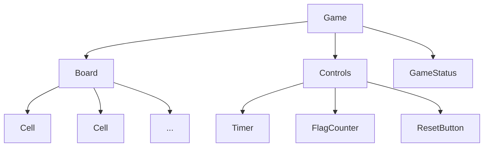

Certainly! Let's plan the component structure for your Minesweeper game. This step is crucial as it helps us organize our code and makes the development process smoother. We'll identify the main components and sketch out their hierarchy.

Here's a suggested component structure for the Minesweeper game:

1. Game (top-level component)
   - Board
     - Cell (multiple instances)
   - Controls
     - Timer
     - FlagCounter
     - ResetButton
   - GameStatus

Let's break down each component and its responsibilities:

1. Game: This is the top-level component that will manage the overall game state and logic.
   - Manages the game state (not started, ongoing, won, lost)
   - Handles game initialization and reset
   - Passes necessary props to child components

2. Board: Represents the game board.
   - Renders the grid of cells
   - Manages the board state (which cells are revealed, flagged, etc.)
   - Handles user interactions with cells

3. Cell: Represents an individual cell on the board.
   - Displays its current state (hidden, revealed, flagged)
   - Shows the number of adjacent mines when revealed
   - Handles click events (reveal, flag)

4. Controls: A container for game control elements.
   - Houses the Timer, FlagCounter, and ResetButton

5. Timer: Displays the elapsed time since the game started.
   - Starts when the first cell is revealed
   - Stops when the game is won or lost

6. FlagCounter: Shows the number of flags placed and total mines.
   - Updates as flags are placed or removed

7. ResetButton: Allows the player to start a new game.
   - Resets the board, timer, and game state when clicked

8. GameStatus: Displays the current status of the game.
   - Shows messages like "Game Over", "You Win!", or instructions

Here's a visual representation of this component hierarchy:

This component structure allows for a clear separation of concerns:
- The Game component manages the overall game state and logic.
- The Board handles the grid layout and cell interactions.
- Individual Cell components manage their own state and appearance.
- Control components (Timer, FlagCounter, ResetButton) handle specific game control functions.
- The GameStatus component provides feedback to the player about the game state.

This structure is modular and scalable, making it easier to implement features and maintain your code as you build your Minesweeper game.

Would you like to move on to the next step of implementing the game logic, or do you have any questions about this component structure?